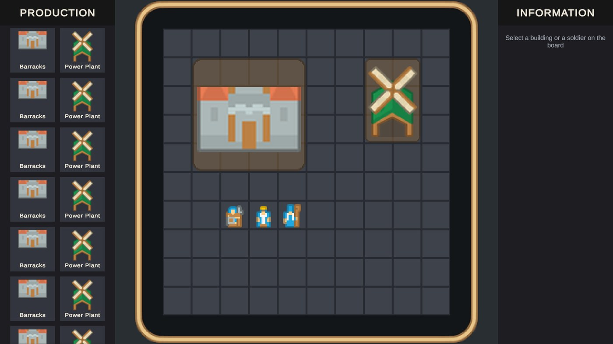
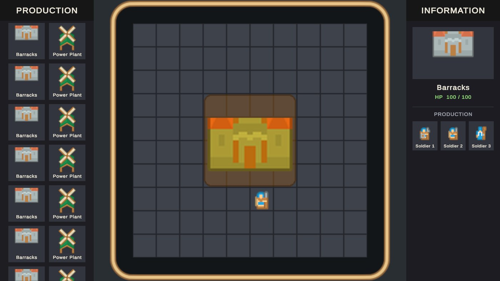
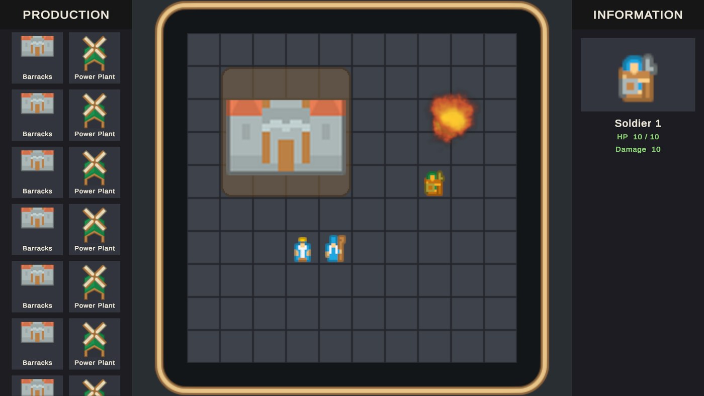
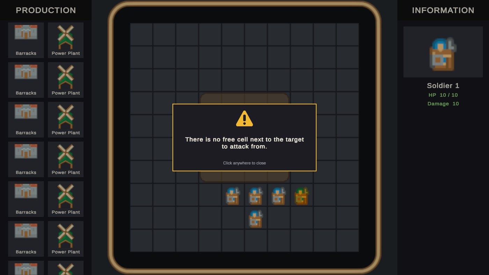

# Panteon Strategy Game Demo

Project overview - architecture, design workflow and how to run it.

| | |
|---|---|
| **Windows build** | [Download PanteonCase-Windows.zip](https://github.com/aliciinar/PanteonCase/releases/latest/download/PanteonCase-Windows.zip) ([all releases](https://github.com/aliciinar/PanteonCase/releases)) |
| **Engine** | Unity 6.3 LTS (6000.3.24f1), URP 2D |
| **Architecture** | [FlowIoC](https://github.com/FlowArc/FlowIoC) 1.22.4 |
| **Entry scene** | `Assets/Modules/MainModule/Scenes/MainScene.unity` |
| **Design test scene** | `Assets/Modules/MainModule/zTestModules/MainTestModule/Scenes/MainTestScene.unity` |
| **PDF version** | [Docs/PanteonCase-Overview.pdf](Docs/PanteonCase-Overview.pdf) |

This project is my submission for the Panteon Game Developer case. This page explains how the game is built, how a
designer can tune and test it without touching code, and why it is built on **FlowIoC**. The last section goes into
the details of how FlowIoC is used in the project, for reviewers who want to follow the code.



## Getting started

### Play the Windows build

1. Download **PanteonCase-Windows.zip** from the [latest release](https://github.com/aliciinar/PanteonCase/releases/latest).
2. Extract it and run `PanteonCase/PanteonCase.exe` - keep the files next to it; the game needs them. The build is not
   code-signed, so Windows SmartScreen may warn on first launch: **More info → Run anyway**.
3. The game opens in a resizable window; drag its edges to try other sizes and aspect ratios, or press
   **Alt+Enter** for full screen.

### Open the project

1. Open the project with **Unity 6000.3.24f1** (Unity 6.3 LTS).
2. Packages resolve on their own: FlowIoC comes from the OpenUPM scoped registry listed in `Packages/manifest.json`.
3. Open `Assets/Modules/MainModule/Scenes/MainScene.unity` and press **Play** - or open **MainTestScene** to play on
   the designer's test configs (see [the design test scene](#4-the-design-test-scene---maintestscene)).

### Controls

| Action | Input |
|---|---|
| Place a building | Click it in the production menu, drag the ghost on the board, confirm with the tick (or cancel with the cross) |
| Select a building or a soldier | Left click on it |
| Produce a soldier | Select a Barracks, click a soldier card in the information panel |
| Move the selected soldier | Right click on an empty cell |
| Attack with the selected soldier | Right click on a building or a soldier |
| Scroll the production menu | Mouse wheel or drag |
| Close a message | Click anywhere |

## 1. Built on FlowIoC

The whole project is written on **FlowIoC**, a signal-driven inversion-of-control framework for Unity. A game is split
into modules that each own their state, logic and presentation. Modules never reference one another: they talk through
signals, and the only place two modules meet is a *Connector*. Every piece of work is a small *Command* bound into a
readable sequence, state lives in *Models*, and scene objects are thin *Views* driven by *Mediators*.

> **I took part in the development of FlowIoC.** I know its internals, its tooling and the reasons behind its rules,
> which is why I chose it for this case: it let me spend the time on the game itself while keeping the code structured
> the way a production team would expect.
>
> FlowIoC on GitHub: **[github.com/FlowArc/FlowIoC](https://github.com/FlowArc/FlowIoC)**

### Why FlowIoC - the advantages in this project

- **Hard module boundaries** - every module has its own assemblies (Runtime, Shared, Signals). A module cannot even
  compile a reference to another module's internals - the compiler, not discipline, keeps the architecture clean.
- **Flows you can read in one place** - each context binds a signal to a sequence of commands. Reading the binding tells
  you exactly what an operation does, step by step, without opening every class.
- **Small, focused units** - decisions live in Commands, state in Models, scene references in Views. No MonoBehaviour
  god-classes, no singletons, no static state that survives between play sessions.
- **Loose coupling through Connectors** - features are wired declaratively. Replacing or removing a module means
  changing its connections, not hunting for call sites across the codebase.
- **Production services included** - screens (Addressables, layers, pooled instances), object pooling, loading sets and
  an update provider come with the framework, so none of them had to be written from scratch.
- **Data-driven by design** - ScriptableObjects are filed on a Root's adapter and read through a shared data model, so
  configuration is swappable per scene - which is what makes the design test scene possible.
- **Tooling** - module generator, Module Scanner (checks folders, assemblies, references and namespaces), generated
  module cards (`MODULE.md`) and the Flow Console, which traces every signal and command.
- **Testable in isolation** - every module can ship a test module with its own scene, so a screen or a system can be run
  and checked on its own.

## 2. The game

A 2D strategy sandbox on a 10×10 grid of 32×32 px cells. The screen has three parts: the **production menu** on the
left, the **game board** in the middle and the **information panel** on the right. Camera and UI adapt to the window's
size and aspect ratio; the board is always fitted between the two panels.

### Features

- **Infinite production menu** - an endlessly scrolling list of buildings built on object pooling: only the cards on
  screen exist, and they are recycled as rows scroll in and out.
- **Placement** - picking a building shows a ghost on the nearest free area, coloured green where it fits and red where it
  does not, with its name and size (*Barracks 4×4*). It can be dragged and is confirmed or cancelled with the buttons
  above it.
- **Buildings** - Barracks (4×4, 100 HP) and Power Plant (2×3, 50 HP). New building types are added purely in data.
- **Production** - selecting a Barracks shows its image, health and the soldiers it produces. Clicking a card spawns
  that soldier, which walks out of the building's door to its spawn point - or, when that is taken or walled off, to
  the nearest free cell it can walk to (one **BFS** out of the door finds both the cell and the walk).
- **Soldiers** - three types, 10 HP each, dealing 10 / 5 / 2 damage. Left click selects, right click on an empty cell
  moves along the shortest path (**A\***, routing around buildings).
- **Combat** - right click on a unit or building attacks it: one **A\*** whose goal is any free cell next to the target
  walks the soldier to the side it can reach soonest, and it strikes. Hits flash the target and show a health bar; at 0 HP it is destroyed with a
  pooled explosion effect.
- **One action at a time** - while a unit is acting, the game is locked through a single runtime asset, so orders never
  overlap.
- **Feedback** - a selected building or soldier is highlighted on the board and shown in the information panel; an
  order that cannot be carried out (no way to the target or to any side of it, no free cell a new soldier can walk to)
  opens a message popup.

| A selected Barracks and the soldiers it produces | A destroyed Power Plant explodes in pooled puffs |
|---|---|
|  |  |

### Performance

- Everything that comes and goes is pooled: production cards, buildings, soldiers, unit cards and explosion effects.
- The board's cells are one Tilemap - a single mesh built once, not an object per cell - so a bigger grid costs
  nothing per frame.
- All game sprites are packed into two sprite atlases (board and UI), share one material and are dynamically batched.
  Measured in play: **10 batches / 9 SetPass calls** with the full board on screen (target: under 20).
- Nothing polls in `Update`: input is read only while a button is held, through FlowIoC's update provider, and window
  resizes are events rather than checks.

## 3. Designed for designers - ScriptableObject configuration

Every value a designer might want to change lives in a **ScriptableObject config** (`CD_` assets), never in code or
scattered over prefabs. Changing the game's balance, look or feel is an edit in the Inspector.

| Config | What it controls |
|---|---|
| `CD_Buildings` | Per building: name, menu icon, board sprite, footprint, health, the units it produces, its door and spawn point (edited on a visual cell map in the Inspector). For all buildings: selection colour, hit flash, health bar layout, placement ghost colours and the explosion (sprites, number of puffs, size, timing). |
| `CD_Units` | Per soldier: name, sprite, health, damage, walking speed, strike duration and lunge reach. For all soldiers: selection colour, hit flash, explosion, and the messages shown when an order is refused. |
| `CD_GameBoard` | Grid size, cell size in pixels, pixels per unit, frame padding and the cell sprite. |
| `CD_ProductionMenu` | Columns, card size and spacing of the production menu. |
| `CD_PopupScreen` | The popup's icon and its opening animation. |

Runtime-only state is kept apart from configuration in `RD_` assets - for example `RD_Grid` shows the live board in
the Inspector while playing, and `RD_GameStatus` holds the one-action-at-a-time lock.

## 4. The design test scene - MainTestScene

The game can also be launched from a dedicated test scene:
`Assets/Modules/MainModule/zTestModules/MainTestModule/Scenes/MainTestScene.unity`. It is the full game, but it runs on
**test copies of every design config**, so a designer can experiment freely without changing what ships.

- **Test configs** - `CD_Buildings_Test`, `CD_Units_Test`, `CD_GameBoard_Test`, `CD_ProductionMenu_Test` and
  `CD_PopupScreen_Test` in `MainTestModule/Scriptables`. They are assigned to the scene's Roots as overrides; the
  shipped configs and `MainScene` are never touched.
- **A prepared start board** - `RD_Grid_Test` lists which buildings and soldiers stand on which cells when the game
  starts, everyone at full health. A designer can set up a situation once (a besieged soldier, a crowded board, a
  specific layout) and get it back on every Play.
- **How to use it** - open `MainTestScene`, edit the `_Test` assets or `RD_Grid_Test`, press Play. A separate test
  context checks that the scene really runs on the test copies and places the start board as soon as the board is built.



## 5. Documentation in the project

Besides this page and its [PDF version](Docs/PanteonCase-Overview.pdf), every module carries its own card,
`MODULE.md`, next to its code: what the module is for, the decisions whose reasons are not visible in the code, and its
known gaps. Its lower half - assemblies, root, context, incoming and outgoing signals - is generated by FlowIoC's
Module Scanner, so it always matches the code. The case brief itself is in `Assets/Resources`.

## 6. Known limitations

- Soldiers walk through one another on the way; each still stops on a cell of its own.
- The click that closes a message popup counts as a press on UI, so it also clears the selected soldier.
- Pool keys are strings, as FlowIoC's pool expects; a typo in a key only shows at run time.
- The `_Test` configs are copies: a field added to a config later appears in its test copy with the default value.

## 7. What I would add next

- **Local avoidance** so soldiers keep apart while walking, and **box selection** to order several soldiers at once.
- **An opposing side** with a simple AI, so combat has a purpose beyond the sandbox.
- **Sound** for placement, strikes and explosions, and a **UI theme config** so panel and text colours are data too.
- **Pool keys as enums** per module, so a wrong key is a compile error rather than a run-time one.
- **Automated tests** for the grid's searches (BFS and A\*) in the Grid module's test module.

## 8. Details - how FlowIoC is used in this project

### Module map

| Module | Kind | Responsibility |
|---|---|---|
| MainModule | Core | Boots the game (loading screen, screen preloading, pool warm-up) and announces `Started`; reports window resizes. |
| ScreenModule | Core | Hosts the screen manager; owns the generic **PopupScreen**. |
| ConnectorModule | Core | The only place modules meet: one sub-context per counterpart wires Outgoing signals to Incoming ones. |
| GridModule | System | Owns the grid and everything standing on it, health included; resolves what a click landed on; BFS / A\* searches behind `IGridService`. |
| GameBoardModule | System | Draws the framed board as one Tilemap and announces its bounds. |
| BuildingsModule | System | Placement, board buildings, selection, destruction; hosts the **ProductionMenuScreen**. |
| UnitsModule | System | Spawning, selection, movement, combat and destruction of soldiers. |
| InputModule | System | The only reader of raw input; announces presses, drags and right clicks in world units. |
| CameraModule | System | Fits the board into the space left between the two panels. |
| GameplayModule | System | Owns the action lock; hosts the **InformationScreen** and **InfoScreen**. |
| LoadingModule | Service | Loading sets and progress for the boot, with its loading screens. |

### Signals and connectors

A module's public surface is its signal holder: `Incoming` is what it accepts, `Outgoing` what it announces.
Connectors join them, and translate where the payload differs:

```csharp
// UnitsConnectorSubContext - what the units module hears and what it tells others
_gridSignals.Outgoing.UnitPressed.Connect(_unitsSignals.Incoming.SelectUnit);
_gridSignals.Outgoing.OccupantSecondaryPressed.Connect(_unitsSignals.Incoming.AttackWithSelectedUnit);
_unitsSignals.Outgoing.UnitSelected.Connect(_infoScreenSignals.Incoming.ShowUnitInfo);
_unitsSignals.Outgoing.OrderRefused.Connect(_popupScreenSignals.Incoming.ShowPopup);
```

### Flows are read from one context

An operation is a sequence of commands bound to a signal. Each command does one unit of work and hands its result to
the next step; a command that can fail stops the sequence.

```csharp
// UnitsSystemContext - an attack order, top to bottom
CommandBinder.Bind(_signals.Incoming.AttackWithSelectedUnit)
    .ToSequence<PlanAttackCommand>()            // one A* to any free cell next to the target, or refuse
    .ToSequence<StrikeWithBoardUnitCommand>()   // walk, lunge, strike (DOTween sequence)
    .ToSequence<SignalDispatchCommand>(_signals.Outgoing.ActionStarted);  // locks the game
```

The whole attack, across modules: **Input** reports the right click → **Grid** finds what is under it and announces
`OccupantSecondaryPressed` → **Units** plans and plays the strike → `AttackLanded` → **Grid** lowers the target's
health and, at zero, removes it and announces `BuildingDestroyed` → **Buildings** returns the object to the pool with
an explosion → the unit's action ends and **Gameplay** unlocks the game.

### Rules the project follows

- **The grid owns the board.** A building's or soldier's data exists once, on the cells it covers; no other module
  keeps a copy. A cell leads to the data, and the data to its board object.
- **Models only for state that spans events** - the selected unit, the pending placement, the action lock. Everything
  else travels with the signal or from one command to the next.
- **Decisions belong in commands.** Contexts only declare bindings; views and mediators hold no game rules.
- **Configuration is filed, not dragged around.** A shared config is filed once on a Root's adapter and read through
  `ISharedDataModel`; test Roots can file their own copies - the basis of MainTestScene.
- **Screens are pooled and addressable.** They are opened through `IScreenService` and filled by the command that
  opened them; a screen's prefab references no atlas sprite, so no bundle duplicates an atlas.
- **Services cross module boundaries directly.** `IGridService`, `IPoolService` and `IScreenService` are injected by
  interface; everything else crosses through a Connector.

### Tooling used

- **Create Module** - every module, screen and test module was generated, so folders, assemblies, namespaces and log
  channels follow one shape.
- **Module Scanner** - checks every module's structure and references; the project reports **0 issues**.
- **Flow Console** - traces each signal and command as it runs, which makes a flow easy to follow and debug.

---

Art: Kenney Medieval RTS, Game Icons and Smoke Particles packs (CC0). FlowIoC:
[github.com/FlowArc/FlowIoC](https://github.com/FlowArc/FlowIoC)
